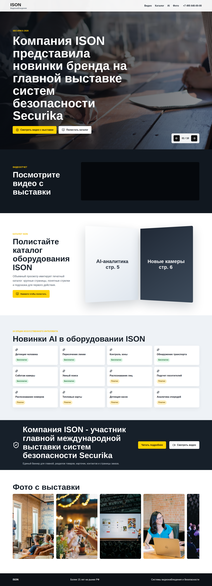
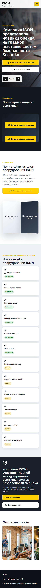

# ISON Securika 2026 — Expo Landing Page

Лендинг-страница для компании **ISON** (системы видеонаблюдения и безопасности), посвящённая участию в международной выставке систем безопасности **Securika 2026**.

---

## Скриншоты

### Десктоп



### Мобильная версия



---

## Технологии

| Слой | Стек |
|---|---|
| Frontend | React 19, Vite, Lucide React |
| Backend | PHP 8.5, Laravel 13, Inertia.js |
| База данных | PostgreSQL 18 |
| Тесты JS | Vitest, Testing Library |
| Тесты PHP | PHPUnit 12 |
| Контейнеризация | Docker Compose |
| CI | GitHub Actions |

---

## Структура страницы

- **Hero** — слайдер из 10 фотографий с выставки, CTA-кнопки «Смотреть видео» и «Полистать каталог»
- **Видеоотчёт** — встроенное VK-видео с выставки
- **Каталог ISON** — анимированная «книга» со страницами каталога
- **Новинки AI** — сетка из 12 опций искусственного интеллекта (Free / Paid)
- **Промо-баннер** — ссылки на страницу выставки
- **Галерея фото** — горизонтальная прокрутка фотографий

---

## Быстрый старт

### Предварительные требования

- [Docker](https://docs.docker.com/get-docker/) и Docker Compose
- [Node.js](https://nodejs.org/) 20+

### Запуск с Docker Compose

```bash
cp .env.example .env
# Заполните DB_PASSWORD и POSTGRES_PASSWORD в .env
docker compose up
```

Приложение будет доступно по адресу: [http://localhost:8000/expo](http://localhost:8000/expo)

### Локальная разработка фронтенда

```bash
npm install
npm run dev
```

Откройте [http://localhost:5173](http://localhost:5173) в браузере.

---

## Команды

### Frontend (Node.js / npm)

| Команда | Описание |
|---|---|
| `npm run dev` | Запуск dev-сервера Vite |
| `npm run build` | Сборка для продакшена |
| `npm test` | Запуск тестов (Vitest) |
| `npm run lint` | Проверка кода (ESLint) |

### Backend (PHP / Composer)

| Команда | Описание |
|---|---|
| `composer run test` | Запуск тестов (PHPUnit) |
| `composer run lint` | Проверка стиля кода (Laravel Pint) |
| `composer run format` | Форматирование кода (Laravel Pint) |

---

## CI

Пайплайн GitHub Actions запускается при каждом pull request и выполняет:
1. `npm ci`
2. `npm run lint`
3. `npm test`
4. `npm run build`

---

## Переменные окружения

Скопируйте `.env.example` в `.env` и задайте значения:

| Переменная | Описание |
|---|---|
| `APP_KEY` | Ключ приложения Laravel (генерируется командой `php artisan key:generate`) |
| `DB_PASSWORD` / `POSTGRES_PASSWORD` | Пароль базы данных PostgreSQL |
| `APP_ENV` | Окружение: `local` / `production` |

---

## Лицензия

Проект распространяется под лицензией [GPL-3.0](LICENSE).
